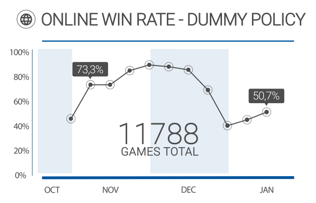
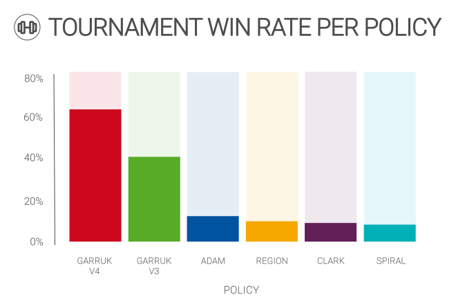

  

This project is the contribution of [Team Jumpstart](https://teamjumpstart.github.io/) to the [InformatiCup2021 challenge](https://raw.githubusercontent.com/informatiCup/InformatiCup2021/master/call_for_participation_a4.pdf) provided by the [German Informatics Society (GI)](https://gi.de/).
We offer our own AI agent that is able to competitively play the game [**spe_ed**](https://github.com/InformatiCup/InformatiCup2021/blob/master/spe_ed.pdf).

The accompanying [paper](https://github.com/TeamJumpstart/InformatiCup2021/releases/download/v1.0.0-submission/Informaticup2021.Theoretische.Ausarbeitung.pdf) documents our approach.

<figure class="video_container">
  <video src="images/Jumpstart_teaser.mp4" width="100%" controls></video>
  
(Music credit: <a href="https://soundcloud.com/user-146897228/heartful-of-kerosene">Heartfül of Kerøsene by Jeff II (CC BY)</a>)

</figure>

---

# Methods

## Path Length Heuristic

  

The [path length heuristic](https://github.com/TeamJumpstart/InformatiCup2021/blob/main/heuristics/pathlength_heuristic.py) performs a random walk up to a certain number of steps (e.g. 5).
The action leading to the longest path is selected, as longer paths imply a strong possibility of surviving longer.
Performing only one walk in each direction might lead to a strong variation.
Therefore, we perform multiple walks for each available action and select the longest path available.
If we reach the maximal number of allowed steps, we can opt out for the specified initial direction, as our value already reached the maximum.

---

## Region Heuristik

  

The [region heuristic](https://github.com/TeamJumpstart/InformatiCup2021/blob/main/heuristics/region_heuristic.py) computes a score for each region.
A high score indicates a large region with few opponents, whereas a low score represents a small, unattractive region.
To obtain region score, it divides the number of available cells by the number of opponents plus one.
Big regions allow us to perform more actions and thus survive for a longer period of time.
However, opponents are a non-negligable factor to consider as well, since having to share a region with another player makes the region less desirable.
Furthermore, encountering opponents might result in unnecessary fights, that will additionally divide the region.

## Region Heuristik with Jumps

  

The value of the region heuristic does not change a lot from one step to another. However, simulating multiple future steps might lead to a drastic change in value, since jumps become more likely. This can motivate the agent to speed up and perform a jump into a different region with a better score.
Ultimately, one could even assign the region value to each single cell and smooth it out as a gradient to reach the position with the biggest available space around it.

---

## Region Heuristik Monte-Carlo

  

Simulating only one random path often leads to unsatisfactory results.
To mitigate the risk of performing one wrong action and thus missing the perfect move, we perform a Monte-Carlo simulation.
More precisely, we simulate multiple paths for each available action and select the best possible result.
In this way, we are able to neglect the negative impact of the stochastic approach of randomized walks and reduce the variance of our obtained results.

---

## Morphological Operations

  

Morphological operations allow us to virtually manipulate the board state to account for different scenarios, such as jumps or opponents closing small chocking points.
An opening operation opens all one and two cell wide walls, to acknowledge the possibility of simple jumps, that can easily cross neighbouring regions.
In this way, we are able to connect divided regions and approximate the upper limit of safely reachable cells.
On the contrary, the closing operation closes all one and two cell wide openings.
Thus, it is a extremly conservative approximation of the available cell space, accounting for enemies closing small gaps and connections between two connected regions.
It allows us to avoid entering corridors, which might be a trap for our agent and result in a not immidiate, but certain death.

---

## Occupancy Map

  

---

# Analysis

## Win Rate

  

This diagram visualizes the win rate of our dummy policy (Adam) during the tournament.
Our agent was able to achive a win rate of over 50%, despite using a simple strategy.
It performs a limited depth-first search for the longest path and performs its first action, after a fixed amount of searched paths.
This straigthforward strategy was able to consistently win against server bots, which do not show complex behaviors, but was not supposed to beat high-level strategies.
This way, we were able to coarsly filter interessting games, by finding those policies that could consistently beat ours.
To our surprise, the online competition was not very fierce, as it won most of its played games.
Thus, we could deduce, that our opponents neglected the online server in favor of offline play or intentionally held back their sophisticated strategies.

---

## Opponents Scatter Plot

  

An in depth analysis of our online opponents showed, that initially most of our encountered enemies were server bots.
Later on, logging bots of other teams appeared.
Those also played permanently on the server, but did not show any reasonable strategies.
We had to assume they were only collecting data, similar to us. Other teams with more advanced policies were rare.
This situation changed two weeks before the end of the tournament.
We encountered more interessting enemies with stronger strategies.

---

## Tournament Statistics

  

Our local tournament environment allows us to simulate hundreds of games in a short period of time. With this tool we were able to optimize our final combination of heuristics by playing against other iterations. With variations in the number of players, the board size and the number of players, we can create the perfect enviroment to filter out the best policy among the competitors. Each match-up is evaluated individually against each other policy, as well as aggregated as an overall win rate. Thus, we can fine tune our policies in an evolutionary fashion.
